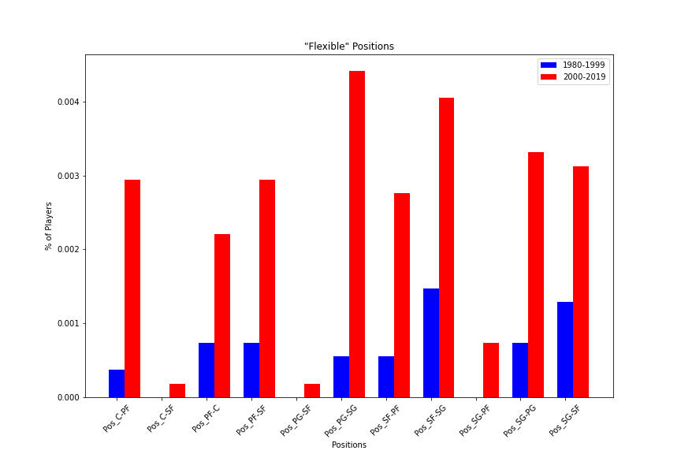
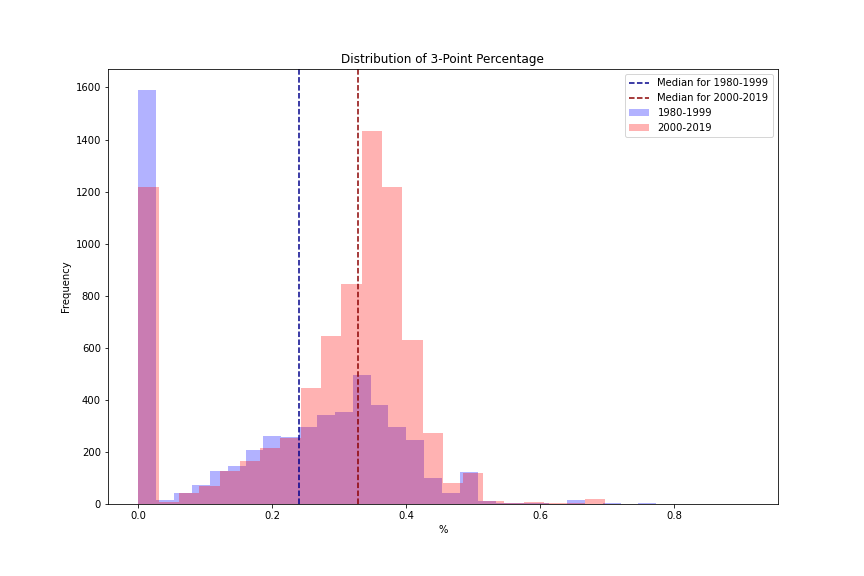
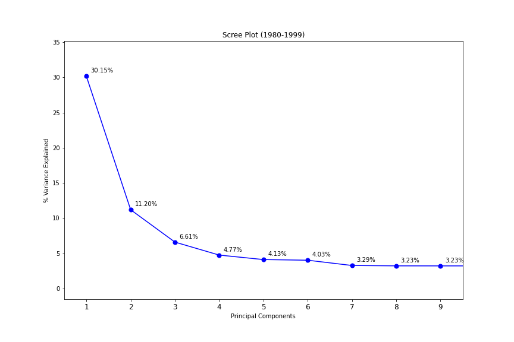
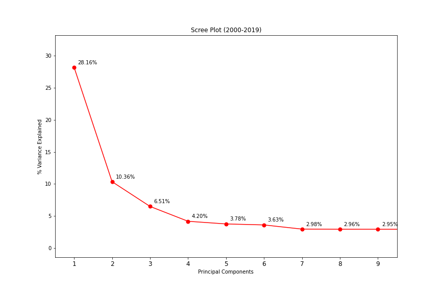
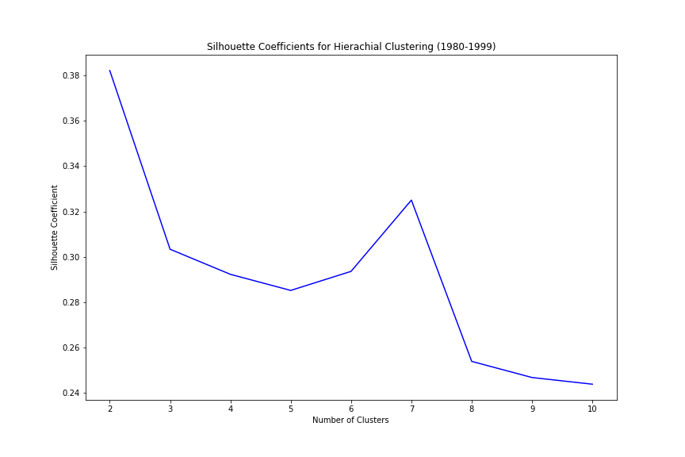
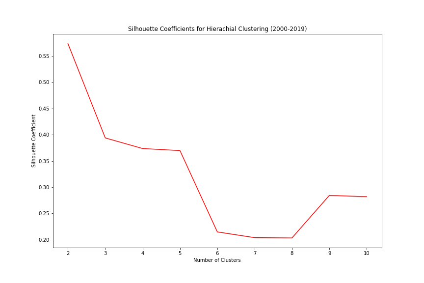
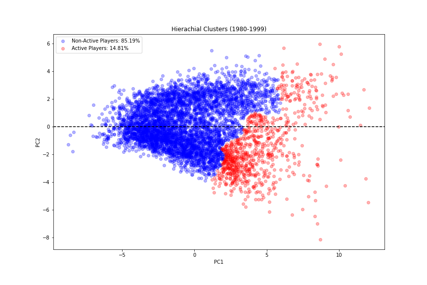
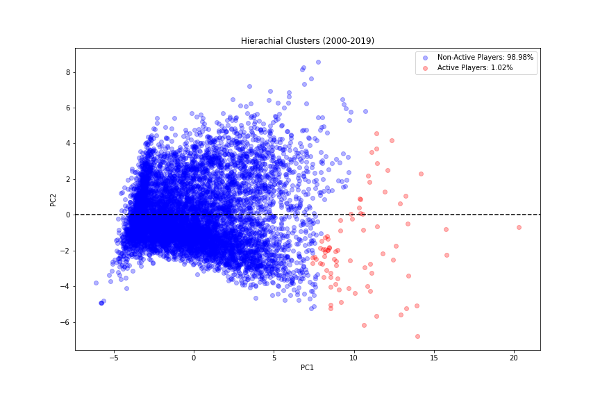

# nba-player-clustering

Unsupervised clustering on NBA players from 1980-2019.

# Introduction

The National Basketball Association (NBA) was founded in the 1940's. Since it's creation, the organization has grown into one of the four major sports leagues in the United States. The NBA has been around for a long time, and I want to see if the game of basketball has changed since the start of the league.

# Data

The data was collected from [Kaggle](https://www.kaggle.com/abhinavp23/nba-stats-player-and-team). It consists of players' season statistics from 1950-2019. However, since the 3-point line was not implemented until 1980, only observations from 1980-2019 will be considered to make the players more comparable. In order to see if there was a change in recent years, the data was split before the 2000 season, which was the first year where the five second rule was implemented. This rule would force players to make faster game time decisions. The player statistics that were accounted for were different shooting statistics, rebounds, turnovers, players' positions, and many more.

# Exploratory Data Analysis

Let's take a look at the assigned positions of these players.

Based on the bar graph above, most of the players in each time period are assigned to one of these "main" positions. There is a slight decrease in the positions closer the basket and a slight increase in the positions farther from the basket.

Players assigned to these more "flexible" positions are more versatile players. Although these players make up a small proportion in either time period, there is still an increase in these more versatile players.

Since the proportion of players positioned farther from the basket increased, there might be an increase in 3-point shot accuracy. Based on the histogram above, 3-point percentage has increased in the second time period.

# Dimension Reduction

Since clustering relies on having smaller dimensions, Principal Component Analysis will be used to reduce the feature dimensions. Another reason to use Principal Component Analysis is that some of these features are highly correlated with each other. For example, 2-point attempts are correlated with 2-point percentage. Scree plots were created to show how many principal components would be optimal.

Based on the scree plots, two principal components would be optimal in representing the relationship between the features.

# Cluster Analysis

Hierarchical Agglomerative Clustering with complete linkage will be used to cluster these players.

Based on the silhouette coefficient plots, two clusters would be optimal for both clustering models.

PC1: measure of how present a player is in every play

PC2: measure of how close the player is to the basket

Looking at the clusters, PC1 determines which players are put into each cluster. After some further digging, the players in the red clusters play more than the players in the blue clusters. The median number of games played, games started, and minutes played were higher for the red clusters in both time periods. Also, after pointing out the outliers in each time period, a common find was that players farther to the right played in the league the longest and were these star players on their respective teams. Players farther to the left were either barely in the league to begin with or did not play as much on their teams. Therefore, the unsupervised clustering decided to split the players based on how present they are on the court and in the league. Another thing to note is that the clustering appears to favor the players farther from the basket. These are the point guards, shooting guards, and small forwards. This could be because these players hussle more and are able to control the game more than the power forwards and centers who rely on these players to feed them the ball.

# Conclusion

This model was able to determine how present a player is on the court and in the league based on their season statistics. The dimension reduction using Principal Component Analsyis was able to associate which positions would have certain higher statistics. For example, it grouped point guards, shooting guards, and small forwards with 3-point percentage, assists, and turnovers, and centers and power forwards were grouped with blocks and rebounds.

Further testing would include a team analysis and see if there are any differences between the teams playing in the NBA.
